# Kings Cut Addis — Entity Relationship Diagram

Generated from `database/SQL/schema.sql`. All foreign keys and cardinalities are shown below.

## Diagram

```mermaid
erDiagram
    customers {
        uuid id PK
        bigint telegram_id UK
        varchar phone_number UK
        uuid qr_token UK
        int total_visits
        decimal total_spending
    }

    staff {
        uuid id PK
        varchar email UK
        varchar role
        varchar password_hash
    }

    services {
        uuid id PK
        varchar name UK
        decimal price
        boolean is_active
    }

    visits {
        uuid id PK
        uuid customer_id FK
        uuid staff_id FK
        timestamp visit_date
        decimal total_amount
    }

    visit_services {
        uuid id PK
        uuid visit_id FK
        uuid service_id FK
        int quantity
        decimal subtotal
    }

    loyalty_rules {
        uuid id PK
        varchar rule_type
        int visit_threshold
        decimal spending_threshold
        int evaluation_period_days
        int expiry_days
        boolean is_active
    }

    rewards {
        uuid id PK
        uuid customer_id FK
        uuid loyalty_rule_id FK
        varchar status
        date expiry_date
    }

    reward_history {
        uuid id PK
        uuid reward_id FK
        uuid staff_id FK
        varchar action
    }

    promotions {
        uuid id PK
        uuid created_by FK
        date start_date
        date end_date
    }

    promotion_recipients {
        uuid id PK
        uuid promotion_id FK
        uuid customer_id FK
        boolean telegram_sent
        boolean sms_sent
    }

    refresh_tokens {
        uuid id PK
        uuid customer_id FK
        uuid staff_id FK
        text token_hash
    }

    customer_sessions {
        uuid id PK
        uuid customer_id FK
        varchar login_method
    }

    sms_logs {
        uuid id PK
        uuid customer_id FK
        varchar delivery_status
    }

    telegram_logs {
        uuid id PK
        uuid customer_id FK
        bigint telegram_id
    }

    system_settings {
        uuid id PK
        varchar setting_key UK
        uuid updated_by FK
    }

    audit_logs {
        uuid id PK
        uuid staff_id FK
        jsonb old_data
        jsonb new_data
    }

    service_orders {
        uuid id PK
        uuid customer_id FK
        varchar status
        timestamp scheduled_at
    }

    service_order_items {
        uuid id PK
        uuid service_order_id FK
        uuid service_id FK
    }

    customers ||--o{ visits : has
    staff ||--o{ visits : records
    visits ||--o{ visit_services : includes
    services ||--o{ visit_services : used_in

    customers ||--o{ rewards : earns
    loyalty_rules ||--o{ rewards : triggers
    rewards ||--o{ reward_history : logged
    staff ||--o{ reward_history : performs

    staff ||--o{ promotions : creates
    promotions ||--o{ promotion_recipients : targets
    customers ||--o{ promotion_recipients : receives

    customers ||--o{ refresh_tokens : has
    staff ||--o{ refresh_tokens : has
    customers ||--o{ customer_sessions : has
    customers ||--o{ sms_logs : receives
    customers ||--o{ telegram_logs : receives
    customers ||--o{ service_orders : places
    service_orders ||--o{ service_order_items : contains
    services ||--o{ service_order_items : ordered

    staff ||--o{ system_settings : updates
    staff ||--o{ audit_logs : performs
```

## Relationship summary

| Parent | Child | Cardinality | FK column |
|--------|-------|-------------|-----------|
| customers | visits | 1:N | visits.customer_id |
| staff | visits | 1:N | visits.staff_id |
| visits | visit_services | 1:N | visit_services.visit_id |
| services | visit_services | 1:N | visit_services.service_id |
| customers | rewards | 1:N | rewards.customer_id |
| loyalty_rules | rewards | 1:N | rewards.loyalty_rule_id |
| rewards | reward_history | 1:N | reward_history.reward_id |
| staff | reward_history | 1:N | reward_history.staff_id (nullable) |
| staff | promotions | 1:N | promotions.created_by |
| promotions | promotion_recipients | 1:N | promotion_recipients.promotion_id |
| customers | promotion_recipients | 1:N | promotion_recipients.customer_id |
| customers / staff | refresh_tokens | 1:N | XOR: exactly one owner |
| customers | customer_sessions | 1:N | customer_sessions.customer_id |
| customers | sms_logs | 1:N | sms_logs.customer_id |
| customers | telegram_logs | 1:N | telegram_logs.customer_id |
| customers | service_orders | 1:N | service_orders.customer_id |
| service_orders | service_order_items | 1:N | service_order_items.service_order_id |
| services | service_order_items | 1:N | service_order_items.service_id |
| staff | system_settings | 1:N | system_settings.updated_by (nullable) |
| staff | audit_logs | 1:N | audit_logs.staff_id (nullable) |

## Design notes

- **QR check-in**: `customers.qr_token` is scanned at the shop; no separate QR table needed.
- **Loyalty windows**: `loyalty_rules.evaluation_period_days` defines the rolling period for visit/spend thresholds (`NULL` = all-time).
- **Refresh tokens**: CHECK constraint ensures each row belongs to either a customer or staff member, never both.
- **Promotion dedup**: `UNIQUE(promotion_id, customer_id)` prevents duplicate broadcast rows.
